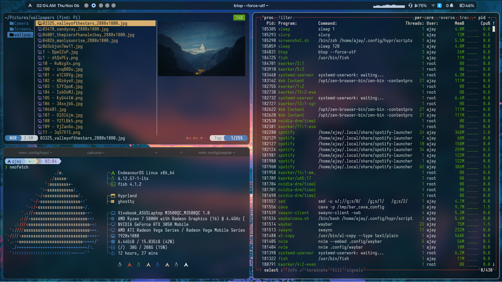
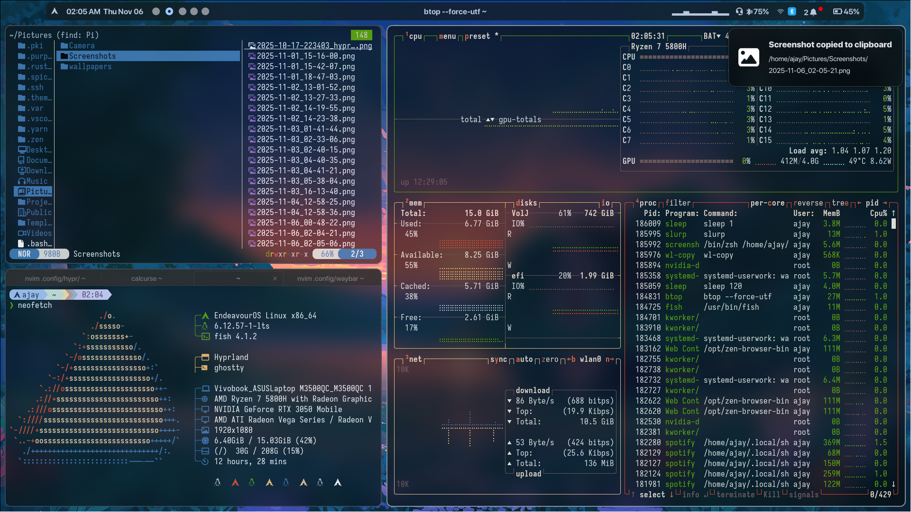
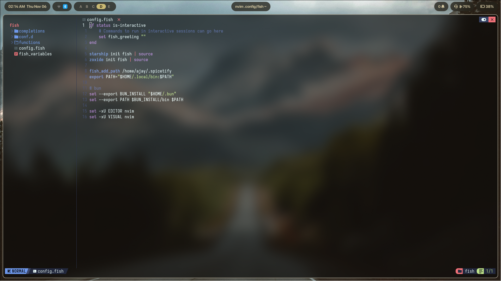
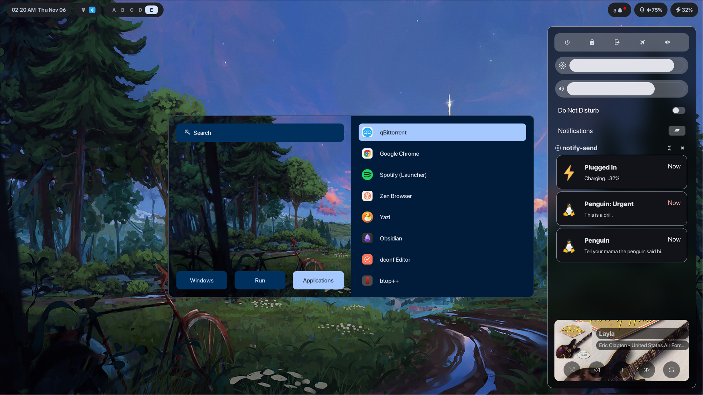

<h1 align="center"> Hyprland Rice</h1>

 clean, minimal, hyprland workflow with endeavouros.
 majorly borrowed from [here](https://github.com/binnewbs/arch-hyprland/tree/main) and other repos

## apps
- **WM**: hyprland
- **shell**: fish, zsh, bash
- **lock**: hyprlock
- **launcher**: rofi
- **bar**: waybar
- **terminal**: kitty, ghostty
- **editor**: neovim (chad), zed, code
- **display manager**: sddm
- **file manager**: yazi, nautilus
- **notifications**: swaync
- **screenshot**: grim + slurp, hyprshot
- **wallpaper and themes**: swww + matugen
- **terminal multiplexer**: zellij, tmux

# screens

### desktop 


### windows and notifications


### neovim


### rofi, waybar and swaync



## structure
```
Projects/hyprdots_pub/
├── README.md
├── screenshots
│   ├── hyprdot_homescreen.png
│   ├── hyprdot_nvim.png
│   ├── hyprdot_window1.png
│   └── hyprdot_window2.png
└── starship.toml

```

## notes
- fonts: SF Pro Display + nerd symbols
- theme: Fluent-dark(gtk), Adventure(ghostty), nvim(nvchad+aquarium)
- icons: Colloid

if you try this setup > get confused anywhere, open an issue / ask me — happy to help.

